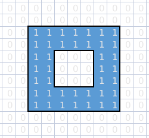
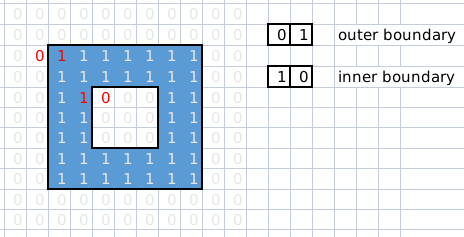
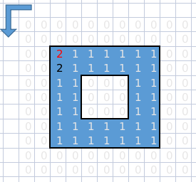
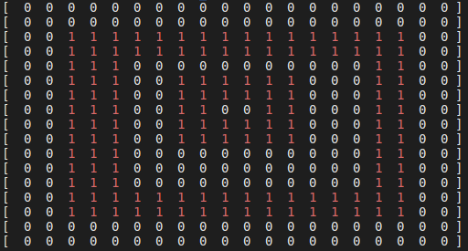
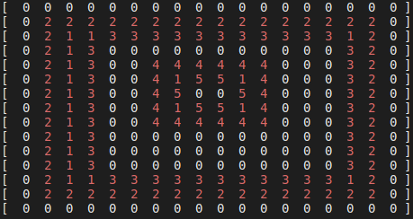
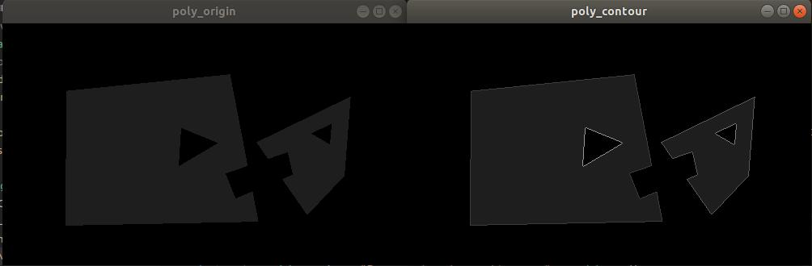
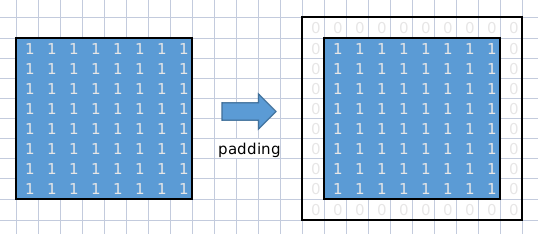
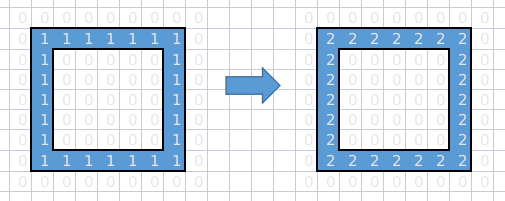
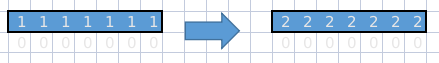

# Find Contours 算法原理以及 C++ 实现

> refs:
> - 知乎 blog: https://zhuanlan.zhihu.com/p/144807771
> - 论文： [Topological Structural Analysis of Digitized Binary Images by Border Following](https://www.sciencedirect.com/science/article/abs/pii/0734189X85900167)
> - TheAILearner blog: https://theailearner.com/2019/11/19/suzukis-contour-tracing-algorithm-opencv-python/

本文为 OpenCV Findcontours( ) 的原理分析以及 C++ 实现。 Findcontours 的算法原型为 suzuki 算法。本文的代码仓库位于 [Github](https://github.com/Alexbeast-CN/findContours)

## 1. 原理

### 1.1 图像处理

对于内部有洞的多边形来说，想要扣出多边形的外边界和内边界其实非常简单。首先将图片处理为二进制，即只有 0 和 1 的格式。如下图所示，蓝色部分为 1，空白部分为 0。之后为了记录边界信息，我们需要对栅格地图中的值进行修改，因此这里引入一个记录边界层次关系的量 `NBD`，并将其初始化为 1。

<center>



</center>

为了方便写代码，这里对一些常用的数据进行 `typedef`

```cpp
typedef std::vector<int>                Listi;
typedef std::vector<Listi>              Mat2i;
typedef std::pair<int, int>             p;
typedef std::vector<p>                  pList;
typedef std::vector<pList>              pMat;
typedef unsigned char                   uint8;
```

### 1.2 遍历图像

之后便可以使用一个左边是 0 右边是 1 的 kernel，从图片的最左上角开始，从左到右，从上到下的遍历整张图像。遍历过程中找到的第一个符合该 kernel 的点便为该几何体的外边界起点。而符合左边是 1 右边是 0 的 kernel，则被认为是集合体内部洞的边界起点。找到边界起点之后，就需要从该点出发，利用一个边界追踪算法，按照顺(逆)时针的顺序找到所有相邻点所组成的边界。
<center>



</center>


### 1.3 边界追踪

在找到边界之后，我们首先对该点 `+NBD` 。需要确定一个边界追踪的方向，一般来说，在找外部的边界的时候，应该逆时针，而找到内部边界的时候则应该顺时针。本文仅用逆时针方向作演示。边界追踪的本质就是检查点的连续性，从迭代的角度来看，就是循环的查看一个点的 8 个邻居里是否 '=1'。

如果按照逆时针的方向追踪边界，则查询周围邻居是否有 1 时也应该为逆时针。除了要确定方向是不行的，要想循环下去，还需要为该方向确定一个起点。由 <起点 - 中心点 - 新邻居> 这三个点便可以确定边界的连续性。

对于第一个查询到的边界起点来说，在边界追踪之前还需要为其确定一个邻居查询的起点。因此我们首先对该点顺时针的查询一次邻居，并把查询到的邻居 `+NBD`，作为该中心点的起点，然后再逆时针的寻找新邻居，将查询到的第一个符合条件的邻居 `+NBD`。

为了循环的去查到邻居，我们将之前的中心点作为新起点，而找到的新邻居作为新的中心点。此过程一直循环，直到找到的新邻居为边界起点为止。

每完成一次边界追踪，就需要对 `NBD + 1`，以构造出不同层次的边界值。

<center>



</center>

此部分的代码为：

```cpp
p FindContours::findNeighbor(const p &center, const p &start, bool ClockWise=true){
    int weight = 1;
    if (!ClockWise) weight = -1;

    pList neighbors{p(0, 0), p(0, 1), p(0,2),
                    p(1,2), p(2,2), p(2,1),
                    p(2,0), p(1,0)};
    Mat2i index{{0, 1, 2},
                {7, 0, 3},
                {6, 5, 4}};
    int start_ind = index[start.first - center.first + 1]
            [start.second - center.second + 1];

    for (int i = 1; i < neighbors.size()+1; i++){
        int cur_ind = (start_ind + i*weight + 8) % 8;
        int x = center.first + neighbors[cur_ind].first - 1;
        int y = center.second + neighbors[cur_ind].second - 1;
        if(grid[x][y] != 0){
            // std::cout << grid[x][y] << std::endl;
            return p(x, y);  
        } 
    }
    return p(-1, -1);
}

void FindContours::board_follow(const p &center, const p &start, bool ClockWise=true){
    bool open_polygon = true;
    std::vector<p> board;

    grid[center.first][center.second] = NBD;

    p new_center    = center;
    p neighbor      = start;
    p new_neighbor  = findNeighbor(new_center, neighbor, ClockWise);

    while (new_neighbor != p(-1, -1)){
        int x = new_center.first;
        int y = new_center.second;
        board.push_back(new_center);

        if (new_neighbor == center){
            for (auto &p : board)
                grid[p.first][p.second] = NBD;
            return; 
        }

        neighbor        = new_center;
        new_center      = new_neighbor;
        new_neighbor    = findNeighbor(new_center, neighbor, ClockWise);
    }
    
    if (open_polygon){
        for (auto &p : board)
                grid[p.first][p.second] = NBD;
            return; 
    }
}
```

## 2. 运行效果

<center>







</center>

之所以 input 的尺寸大于 output，是因为在载入矩阵的时候对模型进行了 padding，即对原始尺寸的外层添加了一层 0。原因在下一节有解释。

此外，算法本身存在一些小问题，在追踪内部边界的时候，拐角处的点会被忽略，这是因为在按顺时针寻找邻居点的时候，第一个被找到的非 0 点并不是拐角点。但实际使用中，可以忽略该问题。

## 3. Corner Cases

### 3.1 尺寸边界

图片的尺寸边界是 1 。在这种情况下，为了防止报错，需要对图像进行 padding。

<center>



</center>

### 3.2 内外边

即是 outer bounary 又是 inner bounary 的情况下，我希望只能会检测出外部边界。因此，在算法运行的过程中，要先运行外部的检测，再运行内部的检测。并且所有检测只针对值为 1 的格子进行。

<center>



</center>

### 3.3 层级关系

对于一些复杂的情况，例如图片中存在多个多边形，则需要对每一个多边形构建清晰的层级关系。首先创建一种数据结构 `pwh (polygon with hole)` 来储存这些带洞的多边形：

```cpp
template <typename T>
using Point     = std::vector<std::pair(T, T)>;
template <typename T>
using Polygon   = std::vector<Point<T>>;

template <typename T>
struct pwh{
    Polygon<T>                 external_poly;
    std::vector<pwh<T>>        holes;
};
```

为了识别出一张图片中的多个 pwh，我们默认图片本身为第一层 pwh，在代码中表现为 `NBD` 的初始值为 1。随后每找到一个满足 `kernel` 的点，便对 `NBD + 1`，并且每一次寻找新的边界起点之前，都会记录上一层的值 `LNBD`，然后根据 `LNBD` 的类型是 outer 还是 hole 来决定层级关系。之所以可行，是因为对一个 pwh 来说，outer 与 hole 一定是交替出现的。假如遍历过程中，连续出现了两次 outer，那么他们一定是并列关系。

```cpp
void FindContours::raster_scan(){
    for (int i = 0; i < rows; i++){
        LNBD = 1;
        for (int j = 0; j < cols; j++){
            if (abs(grid[i][j]) > 1)
                LNBD = abs(grid[i][j]);

            // find the starting point of the boarder.
            if (grid[i][j] == 1 && grid[i][j-1] == 0){
                NBD += 1;
                std :: cout << "out " << NBD << std::endl;
                // do the board trace.
                board_follow(p(i, j), p(i, j-1), false);
                // Display();
            }
            // find the starting point of the hole.
            else if (grid[i][j] == 1 && grid [i][j+1] == 0){
                NBD += 1;
                std :: cout << "in " << NBD << std::endl;
                board_follow(p(i, j), p(i, j+1), true);
                // Display();
            }
        }
    }
    rm_pad(pad_size);    
}
```

### 3.4 非闭合多边形

是否允许出现非闭合的多边形存在。默认是不允许非闭合多边形存在的。如果允许，则需要在 `FindContours::board_follow()` 的最后添加写入以下语句：

```cpp
void FindContours::board_follow(...){
    bool open_polygon = true;
    ...
    if (open_polygon){
        for (auto &p : board)
            grid[p.first][p.second] = NBD;
            return; 
    }
}
```

